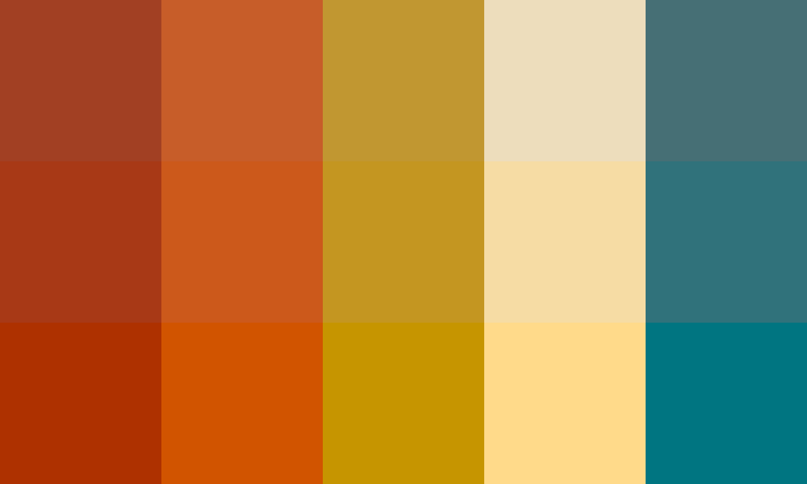
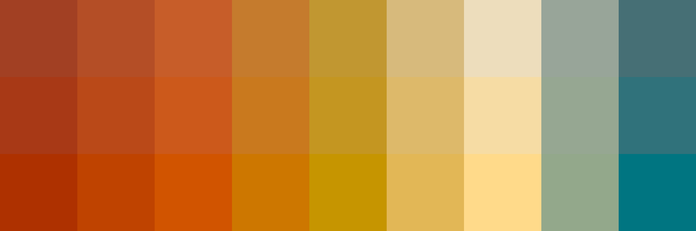

# Palettes

Click any image to go to the source image; the text line above the image to go to the source .hexplt file.

### [`70s_A_saturation_grades_0x1_grid`](70s_A_saturation_grades_0x1_grid.hexplt)

### [`70s_A_saturation_grades_1x1_grid`](70s_A_saturation_grades_1x1_grid.hexplt)

Created with [palettesMarkdownGallery.sh](https://github.com/earthbound19/_ebDev/blob/master/scripts/imgAndVideo/palettesMarkdownGallery.sh).