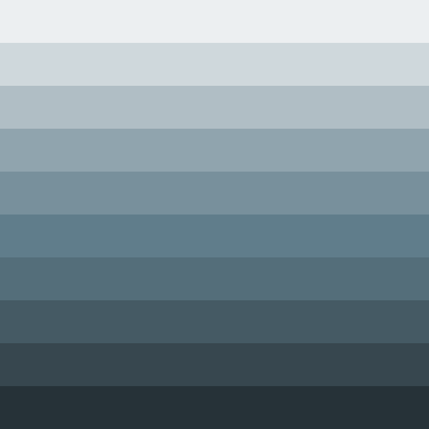

# Palettes

Click any image to go to the source image; the text line above the image to go to the source .hexplt file.

### [`01_Red`](01_Red.hexplt)

### [`02_Pink_or_Magenta`](02_Pink_or_Magenta.hexplt)

### [`03_Purple`](03_Purple.hexplt)

### [`04_Deep_Purple`](04_Deep_Purple.hexplt)

### [`05_Indigo`](05_Indigo.hexplt)

### [`06_Blue`](06_Blue.hexplt)

### [`07_Light_Blue`](07_Light_Blue.hexplt)

### [`08_Cyan`](08_Cyan.hexplt)

### [`09_Teal`](09_Teal.hexplt)

### [`10_Green`](10_Green.hexplt)

### [`11_Light_Green`](11_Light_Green.hexplt)

### [`12_Lime`](12_Lime.hexplt)

### [`13_Yellow`](13_Yellow.hexplt)

### [`14_Amber`](14_Amber.hexplt)

### [`15_Orange`](15_Orange.hexplt)

### [`16_Deep_Orange`](16_Deep_Orange.hexplt)

### [`17_Brown`](17_Brown.hexplt)

### [`18_Gray`](18_Gray.hexplt)

### [`19_Blue_Gray`](19_Blue_Gray.hexplt)

### [`20_Black_and_White`](20_Black_and_White.hexplt)

Created with [palettesMarkdownGallery.sh](https://github.com/earthbound19/_ebDev/blob/master/scripts/imgAndVideo/palettesMarkdownGallery.sh).