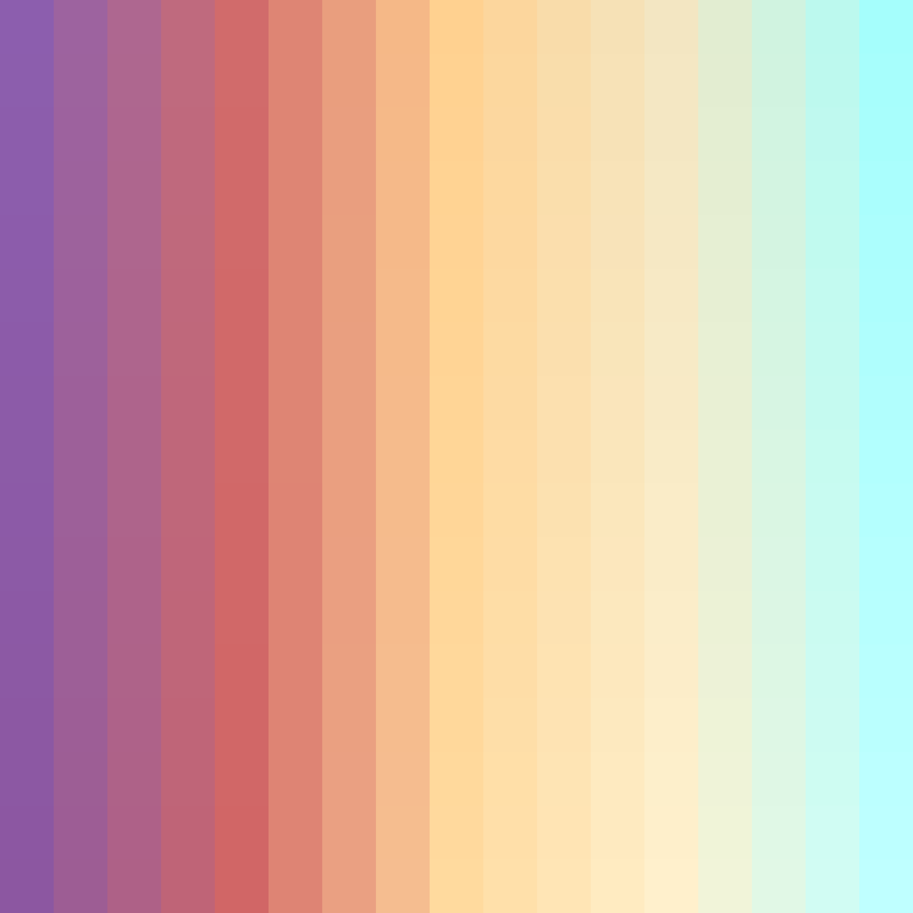
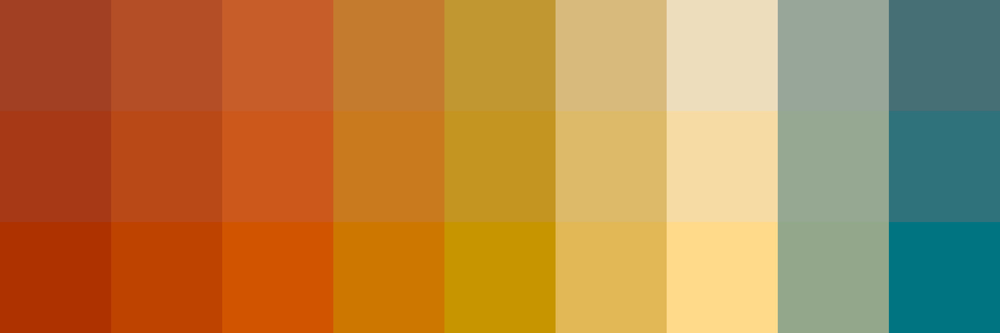

# Palettes

Click any image to go to the source image; the text line above the image to go to the source .hexplt file.

### [`Cool_Cats_Terraformed_and_Faux_Oatmeal_Augmented-3-grid`](Cool_Cats_Terraformed_and_Faux_Oatmeal_Augmented-3-grid.hexplt)

### [`Integration_Augmented-3x15-grid`](Integration_Augmented-3x15-grid.hexplt)

### [`Sunflower_and_Sunburn_Augmented-11-grid`](Sunflower_and_Sunburn_Augmented-11-grid.hexplt)

### [`70s_A_Saturation_Grades_0x1-grid`](70s_A_Saturation_Grades_0x1-grid.hexplt)

### [`70s_A_Saturation_Grades_1x1-grid`](70s_A_Saturation_Grades_1x1-grid.hexplt)

Created with [palettesMarkdownGallery.sh](https://github.com/earthbound19/_ebDev/blob/master/scripts/imgAndVideo/palettesMarkdownGallery.sh).