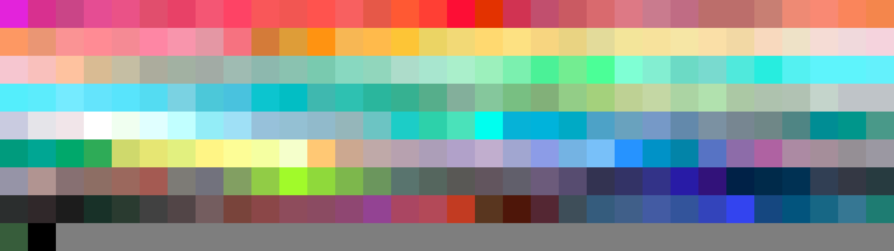

# Palettes

Click any image to go to the source image; the text line above the image to go to the source .hexplt file.

### [`Marker-Like_BG`](Marker-Like_BG.hexplt)

### [`Paradise_BG`](Paradise_BG.hexplt)

### [`Paradise_Darks_BG`](Paradise_Darks_BG.hexplt)

Created with [palettesMarkdownGallery.sh](https://github.com/earthbound19/_ebDev/blob/master/scripts/imgAndVideo/palettesMarkdownGallery.sh).