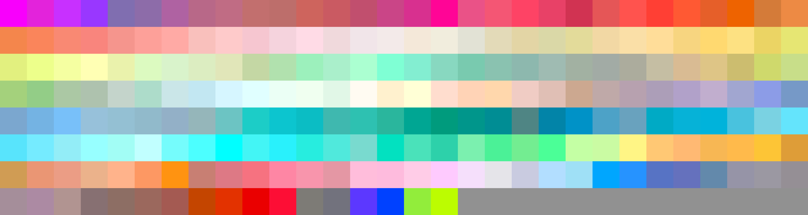
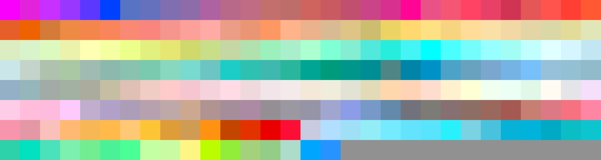
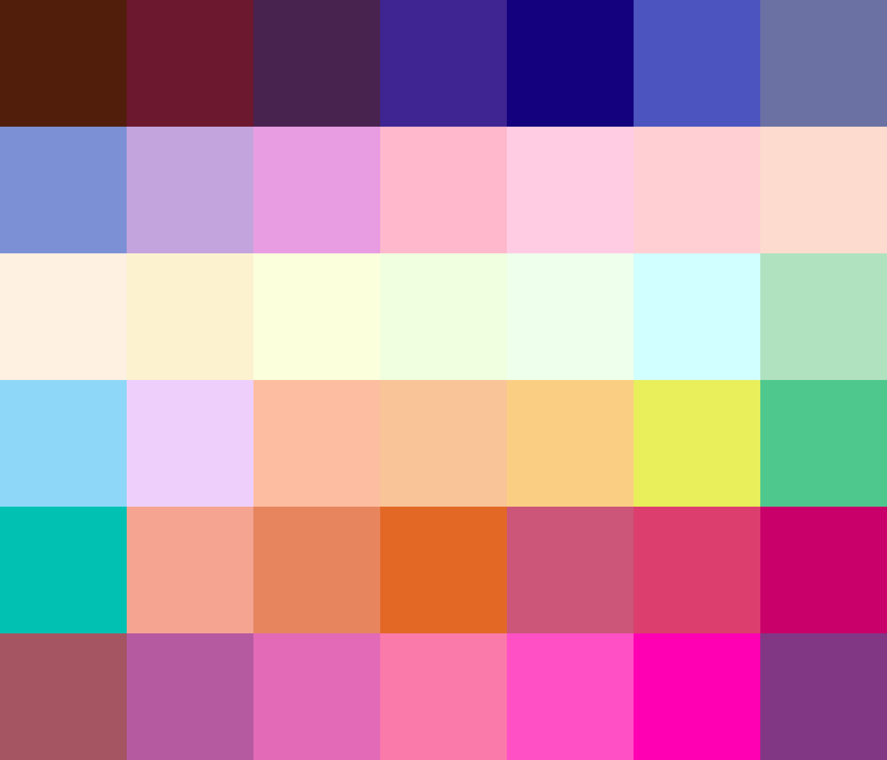

# Palettes

Click any image to go to the source image; the text line above the image to go to the source .hexplt file.

### [`Commodore_VIC`](Commodore_VIC.hexplt)

### [`EB_Favorites_v1`](EB_Favorites_v1.hexplt)

### [`Humanae`](Humanae.hexplt)

### [`Marker-Like_Darks_and_Lights_Looped`](Marker-Like_Darks_and_Lights_Looped.hexplt)

### [`Marker-Like_Lights_mod`](Marker-Like_Lights_mod.hexplt)

### [`Marker-Like_Lights_mod_HCT_sort`](Marker-Like_Lights_mod_HCT_sort.hexplt)

### [`Pantone_2015_Womens_Spring_More_Vivid`](Pantone_2015_Womens_Spring_More_Vivid.hexplt)

### [`Pantone_2015_Womens_Spring_More_Vivid_Alt`](Pantone_2015_Womens_Spring_More_Vivid_Alt.hexplt)

### [`Paradise`](Paradise.hexplt)

### [`RGB_Combos_of_255_127_and_0_Repetition_Allowed`](RGB_Combos_of_255_127_and_0_Repetition_Allowed.hexplt)

### [`Subset_of_Collections_01-03_for_Art_Projects`](Subset_of_Collections_01-03_for_Art_Projects.hexplt)

### [`Watercolor_Pigments`](Watercolor_Pigments.hexplt)

### [`okSolar_dark`](okSolar_dark.hexplt)

### [`okSolar_dark_mod`](okSolar_dark_mod.hexplt)

### [`12_Wheel_source_unknown`](12_Wheel_source_unknown.hexplt)

### [`256_Terminal`](256_Terminal.hexplt)

Created with [palettesMarkdownGallery.sh](https://github.com/earthbound19/_ebDev/blob/master/scripts/imgAndVideo/palettesMarkdownGallery.sh).