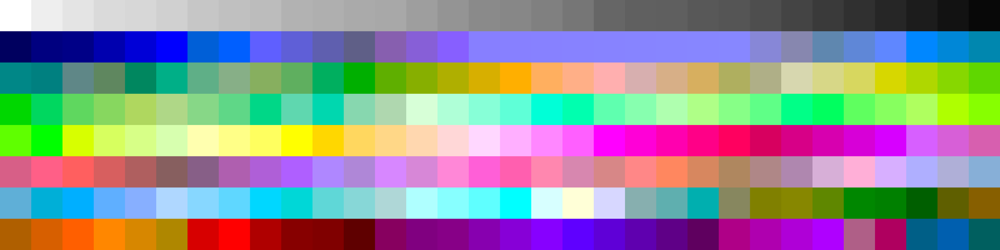

# Palettes

Click any image to go to the source image; the text line above the image to go to the source .hexplt file.

### [`Commodore_VIC`](Commodore_VIC.hexplt)

### [`Humanae`](Humanae.hexplt)

### [`Subset_of_Collections_01-03_for_Art_Projects`](Subset_of_Collections_01-03_for_Art_Projects.hexplt)

### [`12_Wheel_source_unknown`](12_Wheel_source_unknown.hexplt)

### [`256_Terminal`](256_Terminal.hexplt)

Created with [palettesMarkdownGallery.sh](https://github.com/earthbound19/_ebDev/blob/master/scripts/imgAndVideo/palettesMarkdownGallery.sh).